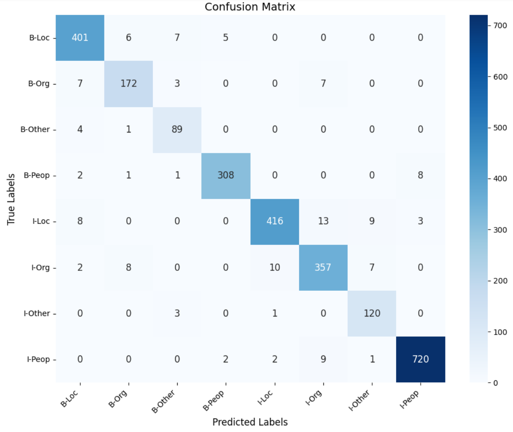

# Named Entity Recognition for Knowledge Graph Construction  

## Overview  
This project focuses on **Named Entity Recognition (NER)** for constructing **Knowledge Graphs (KGs)** from unstructured text. It uses the **CoNLL04** dataset, which contains news articles annotated with entities (PER, LOC, ORG, MISC) and relationships (Work_For, Located_In, etc.). Two approaches are implemented:  

1. **Classical CRF Method**: A Conditional Random Fields model with handcrafted features for sequence labeling.  
2. **LLM-Based Method (BERT+CRF)**: A hybrid approach combining BERT embeddings with CRF.  

The goal is to extract entities and relationships to build structured knowledge graphs.  


---

## Requirements 

To install dependencies, run
```bash  
!pip install -q -r requirements.txt
!python -m spacy download en_core_web_sm 
```  

---
## Running Experiments 

   * Run CRF
   
   ```bash  
   python main.py --crf
   ```  
   Results will be saved to `results.log`.  

   * Run BERT+CRF 
   ```bash  
   python main.py --bert-crf 
   ```  
---

## Experimental Results  
 Evaluation was performed using standard metrics: Micro-F1, Macro-F1, and Weighted-Average F1. The BERT+CRF model outperformed the classical CRF in all metrics, achieving 95.26% Micro-F1 and 86.99% Macro-F1 , compared to 93.28% and 79.90% respectively for CRF. This indicates better performance across all entity types, especially rare and ambiguous ones. 

| METRIC           | CRF MODEL | BERT+CRF MODEL | IMPROVEMENT |
|------------------|-----------|----------------|-------------|
| Micro-F1         | 93.28%    | 95.26%         | +2.1%       |
| Macro-F1         | 79.90%    | 86.99%         | +8.9%       |
| Weighted avg     | 93.16%    | 95.25%         | +2.2%       |

### Confusion matrix for CRF model


### Confusion matrix for BERT+CRF model
